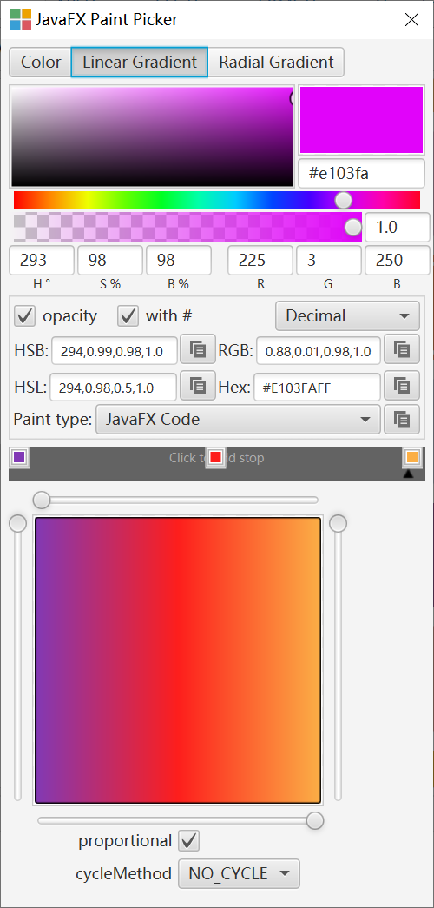
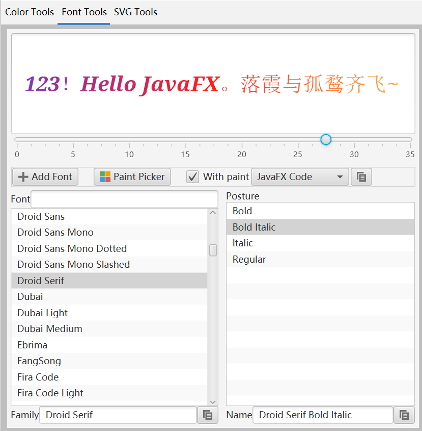
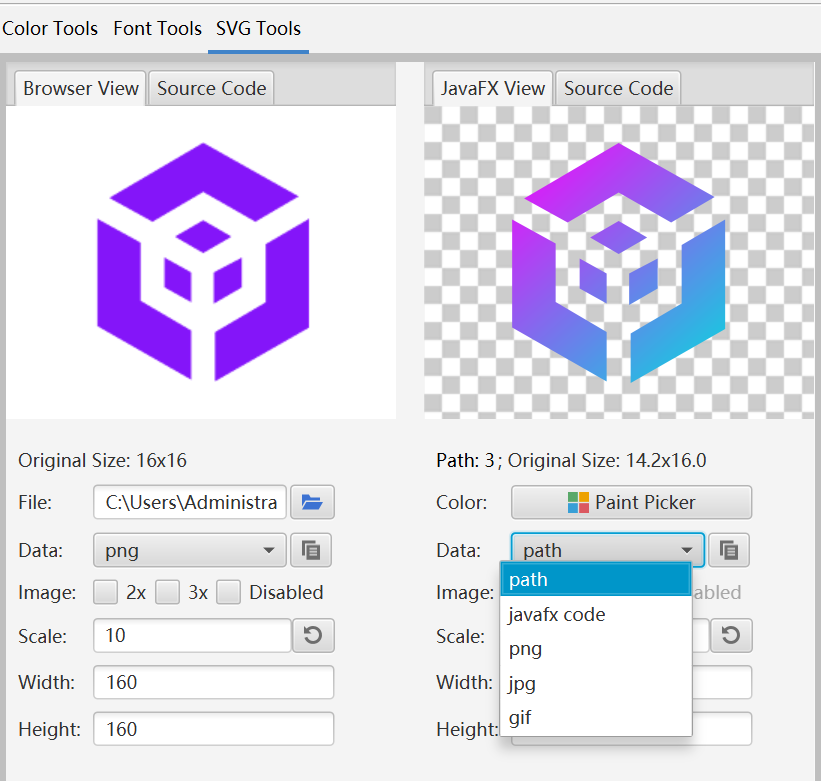
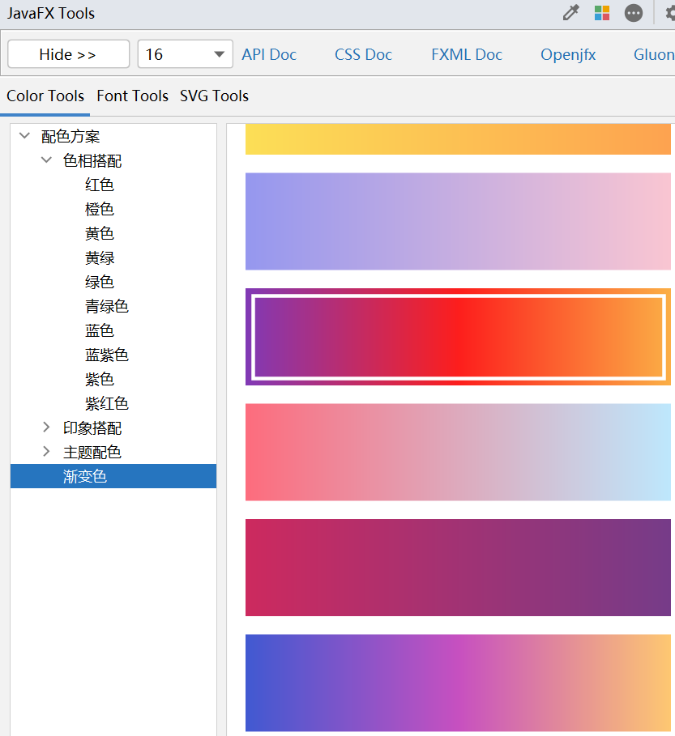
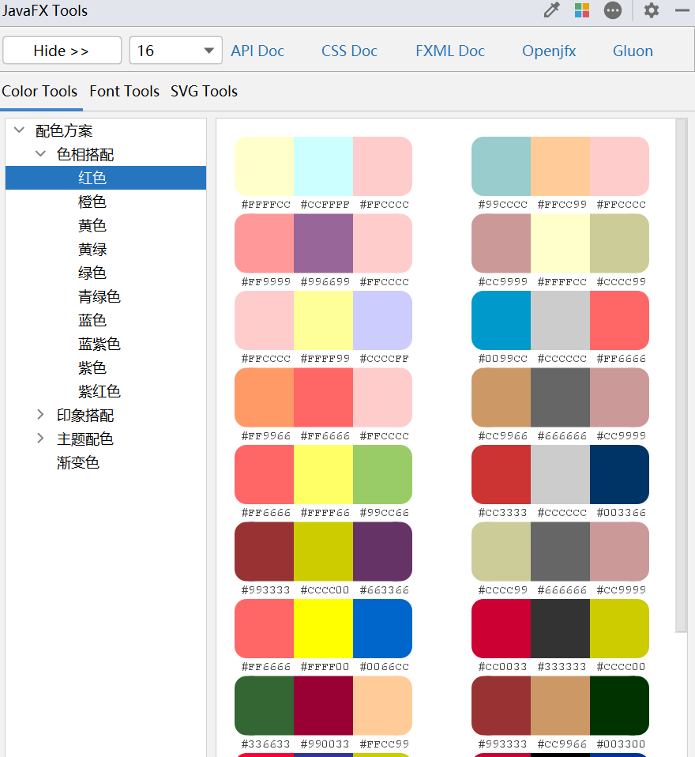

## JavaFX Tools

**Plugin supports Chinese and English.**
### Picture Preview

### How to install
Idea的插件市场搜索 JavaFXTools 就可以下载. 
Idea's plugin market can be downloaded by searching for JavaFXTools.

### Tools Description
- 颜色工具: 你可以直接通过可视化界面来生成颜色的java代码或者css代码 
  Color Tool: You can generate paint/color java code or css code directly through the visual interface.

- 字体工具: 可以快速预览字体效果,生成字体的CSS或者java代码,可以加载第三方字体,识别真实的字体名称; 
  Font Tool: You can quickly preview font effects, generate java code or css for fonts, load third-party fonts, and identify real font names;

- SVG工具: 可以提取svg文件的path路径,或者直接生成图片,支持2x,3x多倍图. 
  SVG Tool: It can extract the path of the svg file, or directly generate the image, support 2x, 3x multiple images.

> It doesn't seem to support Apple Silicon(M1,M1X,M2... ).

### Paint Picker Description
对 [SceneBuilder](https://github.com/gluonhq/scenebuilder) 的颜色代码组件进行了增强,添加了新的功能, 可以直接复制颜色的java代码或者javafx的CSS代码. 

The paint picker component of  [SceneBuilder](https://github.com/gluonhq/scenebuilder)  has been expanded, and new functions have been added, which can directly generate the java code of the paint or the CSS code of javafx.

### Color Description
部分色彩搭配资料来源于网络，但因转载上千次，无法找到确切出处。只能追溯到2002年的兰州大学的网页. 
如果侵权，可以联系我删除。 

Part of the color collocation data comes from the Internet, but due to thousands of reprints, the exact source cannot be found. 
It can only be traced back to the Lanzhou University webpage in 2002;  
If it is infringing, you can contact me to delete it.

### RGB HSL Converter Description
RGB HSL颜色转换代码 转载自: https://blog.csdn.net/weixin_36027600/article/details/114059407
但是由于多次转载,无法找到准确的出处.如果侵权，可以联系我删除。 
RGB HSL Converter, copied from blog. But due to thousands of reprints, the exact source cannot be found.
If it is infringing, you can contact me to delete it.