# JavaFX Tools

[](https://plugins.jetbrains.com/plugin/17514-javafx-tools)
[](https://plugins.jetbrains.com/plugin/17514-javafx-tools)
[](LICENSE)

JavaFX 一站式开发工具包 — CSS 智能提示、Gutter 预览、FXML 代码辅助、Ikonli 图标浏览器、SVG 路径提取、FxmlKit 集成。

同时支持 IntelliJ IDEA **社区版** 和 **旗舰版**，要求 **2024.2+**、Java **17+**。

<a href="https://plugins.jetbrains.com/plugin/17514-javafx-tools"></a>

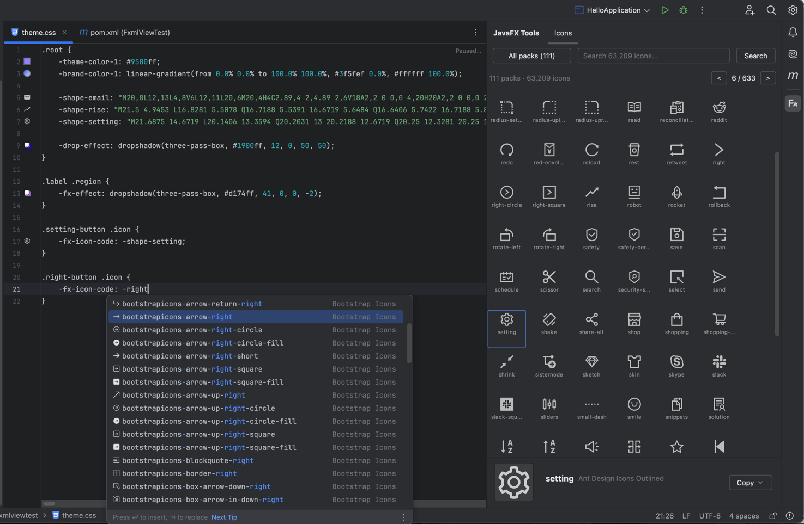

---

## 功能特性

### CSS 智能

**属性补全与文档**
- 210+ 个内置 `-fx-*` 属性，提供类型感知的值补全
- 第三方库自动检测 — ControlsFX、GemsFX、JFoenix 的 CSS 属性，依赖在类路径上即可用
- 快速文档 (F1)，展示多库来源的属性说明
- CSS 变量跨文件补全与解析
- CSS 过渡属性支持 (`transition`、`transition-property`、`transition-duration` 等)
- `-fx-cursor` 值补全带可视化鼠标样式图标

**Gutter 预览**
- 颜色预览 — hex、rgb、rgba、hsl、hsla、命名颜色、`derive()`
- 渐变色预览 — `linear-gradient()`、`radial-gradient()`
- SVG 路径预览 — `-fx-shape` 渲染为缩放路径图标
- 特效预览 — `dropshadow()`、`innershadow()`，含模糊可视化
- Ikonli 图标预览 — `-fx-icon-code` 渲染为 SVG gutter 图标
- CSS 变量解析 — 变量链式解析（最深 10 层）至最终颜色/渐变/SVG
- **多值 Paint 支持** — `-fx-background-color` 和 `-fx-border-color` 每个 paint 段显示一个图标（最多 4 个）

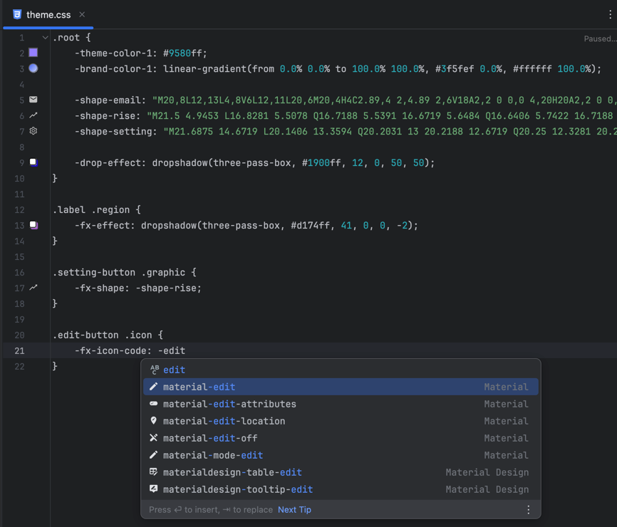

**点击编辑**
- 点击颜色图标 -> 打开内嵌 PaintPicker，实时写回
- 点击渐变图标 -> 打开 PaintPicker 渐变模式
- 点击特效图标 -> 打开 Effect Editor (DropShadow / InnerShadow，4 种模糊类型)
- 点击 SVG 图标 -> 打开路径预览，带尺寸控制
- 所有编辑支持单次 Ctrl+Z 撤销

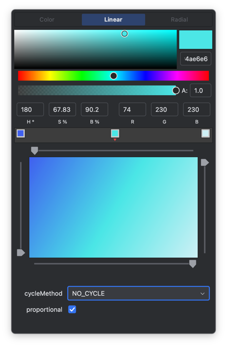

**内联 CSS (Java & FXML)**
- Java `setStyle("...")` — gutter 预览 + 点击编辑 + 自动弹出补全
- FXML `style="..."` — 同样的预览和编辑支持
- Text Block 支持 — 每行独立显示 gutter 图标
- `SVGPath.setContent("...")` — 只读 SVG 预览
- Ctrl+Click 从内联 CSS 变量跳转到 `.css` 定义处

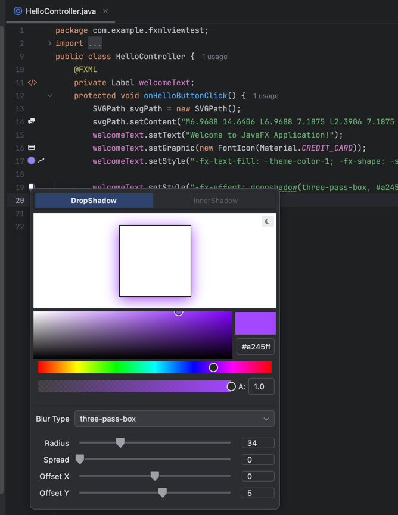

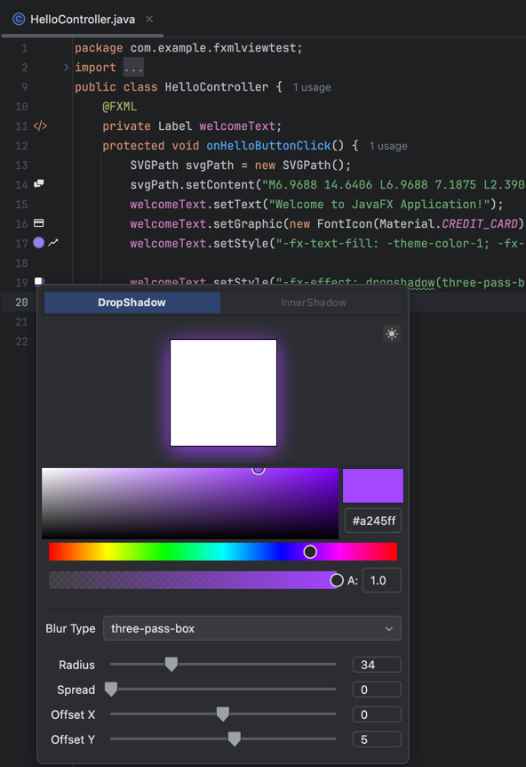

---

### Ikonli 图标集成

**图标浏览器 ToolWindow**
- 58 个图标包，64,800+ 个图标，来自 [Ikonli](https://github.com/kordamp/ikonli) 库
- 跨包模糊关键词搜索
- 图标包筛选器
- 详情面板，展示预览、图标名、包名及来源链接
- 一键复制：SVG 路径 / Java 代码 / CSS 代码 / Maven / Gradle 坐标
- 双击图标可将 SVG 路径数据插入到编辑器光标位置

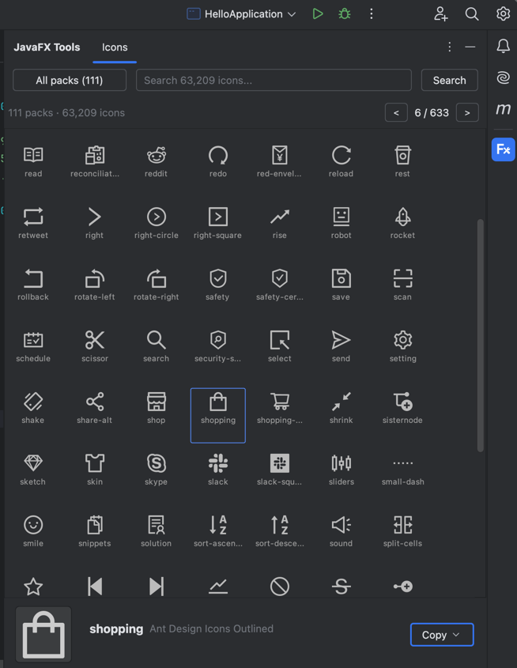

**代码辅助**
- CSS 中 `-fx-icon-code` 值补全，每个候选项带 SVG 预览
- FXML 中 `<FontIcon iconLiteral="..."/>` 补全
- Java 枚举常量 gutter 图标（如 `FontAwesome.HOME` 行内显示图标）
- 类路径感知：仅项目类路径中存在的图标包才会出现在补全中


---

### SVG 路径提取器

**ToolWindow 面板**
- 拖放或打开 SVG 文件，提取并合并路径数据
- 并排预览：原始 SVG vs 提取路径
- 将基本图形（rect、circle、ellipse、line、polyline、polygon）转换为路径数据
- 坐标归一化到目标尺寸，精度可配置
- 一键复制提取的路径字符串

**右键菜单**
- **Copy SVG Path Data** — 在项目视图中右键 .svg 文件，复制合并后的路径数据到剪贴板（支持多选）
- **Open in SVG Path Extractor** — 在 SVG 路径提取器 ToolWindow 面板中打开文件

---

### FXML 代码辅助

**导航**
- View <-> FXML <-> CSS 双向 gutter 导航
- Controller <-> FXML 导航（适用于所有 JavaFX 项目，不限于 FxmlKit）
- `@FxmlPath` 注解：Ctrl+Click 跳转、补全、重命名重构
- 资源路径导航 — `<Image url="..."/>`、`<fx:include source="..."/>`
- `%key` 国际化导航到 `.properties` 文件（需要 `com.intellij.properties` 插件）

**代码检查与快速修复**（14 项检查）
- 缺少 FXML / Controller / CSS 文件 -> 创建文件 Quick Fix
- Controller 中缺少 fx:id 字段 -> 创建字段 Quick Fix，自动推断类型
- 缺少事件处理方法 -> 创建方法 Quick Fix（33 种事件类型）
- @FXML 字段类型不匹配 -> 修改类型 Quick Fix
- 未使用的 @FXML 字段和方法检测
- 无效资源路径、未使用的 CSS 选择器、国际化 key 校验


---

### FxmlKit 集成

基于约定的 JavaFX MVC 结构化模式。

**New -> FxmlKit View 创建向导**
- 一个对话框创建 View + ViewProvider + Controller + FXML + CSS 文件
- 分段式 View 类型选择器 (View / ViewProvider)
- 可选的国际化资源包配置，支持 Locale 选择
- 实时文件树预览，展示即将生成的文件结构

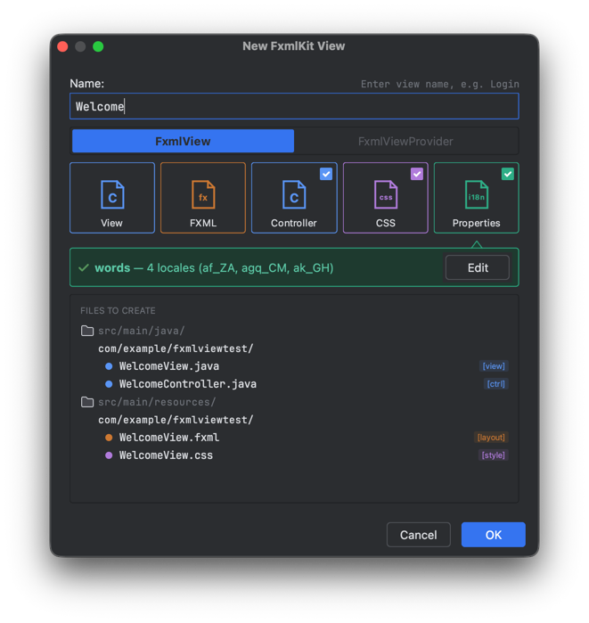

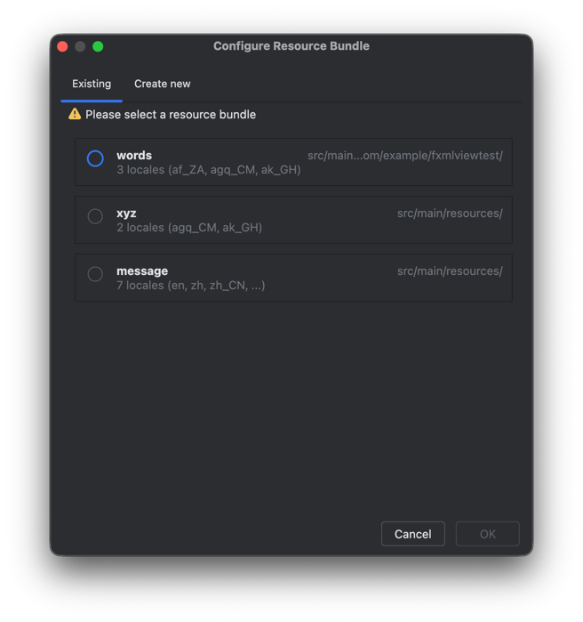

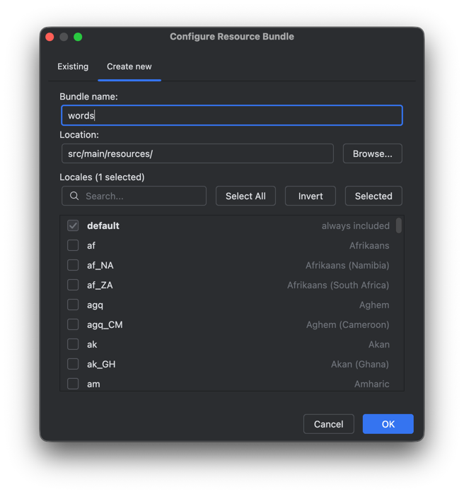

**依赖添加对话框**
- 当项目类路径缺少 FxmlKit 时，弹框询问是否自动向 Maven/Gradle 构建文件和 `module-info.java` 添加 `com.dlsc.fxmlkit:fxmlkit` 依赖
- 自动识别已有 JavaFX 配置（controls / fxml 模块、JavaFX Gradle 插件块），避免重复
- 写入构建文件后自动触发 Maven/Gradle 项目刷新，无需手动 reimport

**Dev 模式启动器**（需要 FxmlKit 1.5.1+）
- 新增两个工具栏按钮：**FxmlKit 开发模式** 和 **FxmlKit 开发模式调试**（仅在 FxmlKit 项目中出现）
- 一键启动时自动注入 `-Dfxmlkit.devmode=true`——FXML 和 CSS 的修改实时生效，无需重启应用
- 尊重用户的 VM 参数：如果命令行里已有 `-Dfxmlkit.devmode=...`（包括 `=false`），保持原值不覆盖
- 版本低于 1.5.1 时弹出模态对话框，提供 **继续启动** 或 **取消** 选项，可勾选"不再为此版本提示"

**属性生成** (Alt+Insert / Cmd+N)
- 10 种属性类型：String、Integer、Long、Float、Double、Boolean、Object、List、Map、Set
- ReadOnly 包装器生成
- 延迟初始化选项
- CSS Styleable 属性生成，自动创建 `CssMetaData` 样板代码
- 对话框内实时代码预览

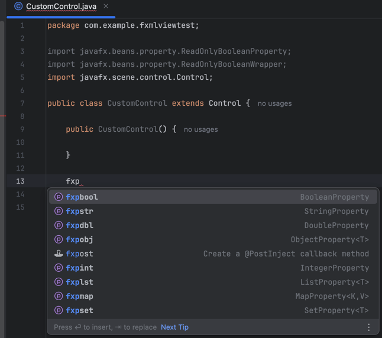

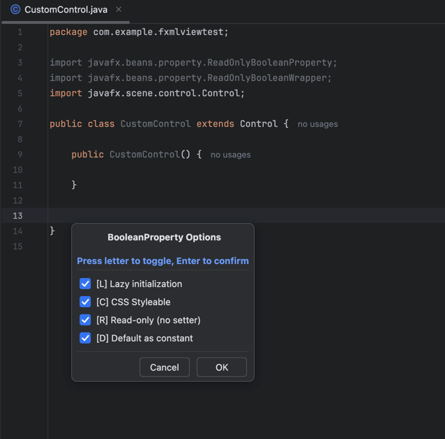

---

### 字体与 SVG 文件操作

- **右键 .ttf/.otf** -> 复制字体族名 / 复制 @font-face CSS
- **右键 .svg** -> 复制 SVG 路径数据 / 在 SVG 路径提取器中打开
- **智能粘贴**：@font-face 代码块粘贴到 CSS 文件时自动计算相对路径
- 支持多文件选中

---

### 设置

Settings -> Tools -> JavaFX Tools

- **Gutter 预览** — 开关 gutter 预览图标，调整图标大小（50%~150%）
- **图标浏览器** — 开关双击图标插入功能
- **通知** — JFX-Central 每周资讯通知

---

## 安装

**从 JetBrains Marketplace 安装：**

1. IntelliJ IDEA -> Settings -> Plugins -> Marketplace
2. 搜索 **"JavaFX Tools"**
3. 点击 Install，重启 IDE

**手动安装：**

1. 从 [Releases](https://github.com/leewyatt/JavaFXTools/releases) 下载最新 `.zip`
2. Settings -> Plugins -> 齿轮图标 -> Install Plugin from Disk -> 选择 `.zip` 文件

---

## 兼容性

| 要求 | 版本 |
|------|------|
| IntelliJ IDEA | 2024.2+（社区版或旗舰版） |
| Java | 17+ |
| JavaFX SDK | 不需要（插件使用 Swing/IntelliJ 平台 UI） |

**第三方 CSS 库支持：**

插件自动检测项目类路径上的以下库，并提供其 CSS 属性：

| 库 | 标记类 | 支持内容 |
|---|--------|---------|
| ControlsFX | `org.controlsfx.control.GridView` | ControlsFX CSS 属性 |
| GemsFX | `com.dlsc.gemsfx.DialogPane` | GemsFX CSS 属性 |
| JFoenix | `com.jfoenix.controls.JFXButton` | JFoenix Material CSS 属性 |
| Ikonli | `org.kordamp.ikonli.Ikon` | `-fx-icon-code`、`-fx-icon-size`、`-fx-icon-color` |

---

## 从源码构建

```bash
# 克隆
git clone https://github.com/leewyatt/JavaFXTools.git
cd JavaFXTools

# 构建
./gradlew buildPlugin

# 启动沙箱 IDE（加载插件）
./gradlew runIde
```

需要 Gradle 8.14 和 JBR 21（在 `gradle.properties` 中配置）。

---

## 致谢

- 内嵌的 PaintPicker（颜色与渐变编辑器）改写自 Gluon 的 [Scene Builder](https://github.com/gluonhq/scenebuilder) 中的 PaintPicker 组件（原版为 JavaFX 实现，本项目改写为 Swing）。感谢 Scene Builder 团队提供的优秀原始实现。
- Ikonli 相关图标数据来自 [Ikonli](https://github.com/kordamp/ikonli) 库。感谢 [Andres Almiray](https://github.com/aalmiray) 为 JavaFX 生态创建并维护了如此丰富的图标包集合。
- 图标浏览器中收录的图标包源自众多开源图标库（如 FontAwesome、Material Design Icons、Weather Icons 等）。衷心感谢每一个图标项目背后的作者和社区。完整的图标库列表及项目地址请参见 [ICON_PACKS_zh.md](ICON_PACKS_zh.md)。
- 特别感谢 [Dirk Lemmermann](https://github.com/dlemmermann) 提供的宝贵反馈、测试以及功能建议，对本插件的完善起到了重要作用。

---

## 赞助商

[DLSC](https://www.dlsc.com) · [JFXCentral](https://www.jfxcentral.com)

---

## 开源许可

[MIT License](LICENSE) — Copyright (c) 2022 LeeWyatt
